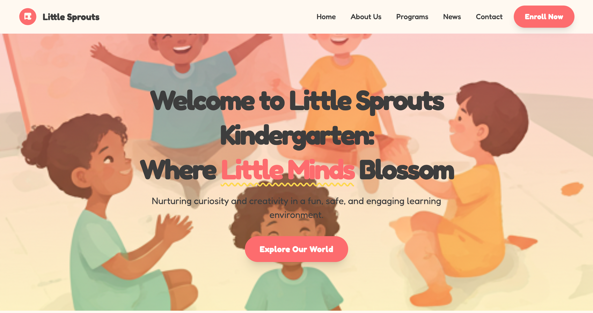

# Little Sprouts Kindergarten Website

A vibrant, responsive website for Little Sprouts Kindergarten, designed to showcase the nurturing environment, programs, and activities offered to young children. This project serves as a prototype demonstrating modern web development skills, including internationalization (English and Arabic), responsive design, and interactive features.

<p align="center">
  
</p>

## 🚀 Live Demo

[View Live Demo](https://chams-sat.github.io/Little-Sprouts/)


## 🌟 Features

- **Responsive Design**: Fully responsive layout that works seamlessly on desktop, tablet, and mobile devices using Tailwind CSS.
- **Bilingual Support**: Switch between English and Arabic with full RTL (Right-to-Left) support for Arabic.
- **Interactive Elements**: Mobile-friendly navigation menu, smooth scrolling, hover effects, and form handling.
- **Child-Friendly UI**: Colorful, engaging design with custom fonts and icons to appeal to families and children.
- **Sections Included**:
  - Hero section with call-to-action
  - About Us with mission, vision, and staff profiles
  - Programs (Toddlers, Preschool, Pre-K) with expandable details
  - Daily activities and rhythm
  - Testimonials from parents
  - Photo gallery
  - News and events with calendar
  - Online registration process
  - Contact form and information
- **Accessibility**: Basic accessibility features with semantic HTML and keyboard navigation.

## 🛠️ Technologies Used

- **HTML5**: Semantic markup for structure.
- **CSS3**: Custom styles with CSS variables for theming, integrated with Tailwind CSS for utility-first styling.
- **JavaScript (ES6+)**: Interactive functionality including language switching, mobile menu, and form submissions.
- **Tailwind CSS**: A utility-first CSS framework used with a local build process for optimized production code.
- **Google Fonts**: Fredoka and Gaegu fonts for a playful, child-friendly typography.
- **Material Symbols**: Icons for visual elements.

## 🚀 Getting Started

### Prerequisites

- [Node.js](https://nodejs.org/) and npm (or a similar package manager).
- A modern web browser (Chrome, Firefox, Safari, Edge).

### Installation

1. **Clone the Project**:
   ```bash
   git clone https://github.com/Chams-sat/Little-Sprouts.git
   cd Little-Sprouts
   ```

2. **Install Dependencies**:
   This will install Tailwind CSS and its dependencies.
   ```bash
   npm install
   ```

3. **Build the CSS**:
   This command compiles the Tailwind CSS into the `dist/output.css` file.
   ```bash
   npm run build-css
   ```

3. **View the Website**:
   - Simply open `index.html` in your browser for a quick preview.
   - For the best experience, it's recommended to use a local server. Many code editors (like VS Code with the "Live Server" extension) have this built-in.

### Usage

- **Navigation**: Use the header menu to navigate sections. On mobile, tap the hamburger menu.
- **Language Switch**: Click the language button in the header to toggle between English and Arabic.
- **Forms**: Fill out the newsletter signup or contact form; submissions are logged to the console (for demo purposes).
- **Responsive Testing**: Resize your browser or use developer tools to test mobile responsiveness.

### Deployment to GitHub Pages

1. **Build the CSS**:
   ```bash
   npm run build-css
   ```

2. **Push to GitHub**:
   - Create a new repository on GitHub.
   - Push your code:
     ```bash
     git init
     git add .
     git commit -m "Initial commit"
     git branch -M main
     git remote add origin https://github.com/yourusername/your-repo-name.git
     git push -u origin main
     ```

3. **Enable GitHub Pages**:
   - Go to your repository settings.
   - Scroll to "Pages" section.
   - Select "Deploy from a branch".
   - Choose "main" branch and "/ (root)" folder.
   - Click "Save".

4. **Access Your Site**:
   - Your site will be available at `https://yourusername.github.io/your-repo-name/`.

**Note**: Ensure you run `npm run build-css` before deploying to generate the latest styles.

## 📁 Project Structure

```
little-sprouts-kindergarten/ +Little-Sprouts/ +├── dist/ +│ └── output.css # Compiled and minified CSS +├── src/ +│ └── input.css # Source CSS with Tailwind directives ├── index.html # Main HTML file ├── style.css # Custom CSS styles and variables ├── main.js # JavaScript for interactivity +├── tailwind.config.js # Tailwind CSS configuration +├── package.json # Project dependencies and scripts ├── README.md # This file -└── .DS_Store # macOS system file (can be ignored) +└── ... # Other configuration files
```

## 🎨 Customization

- **Colors**: Modify CSS variables in `style.css` (e.g., `--primary: #FF6B6B`) to change the theme.
-- **Theme & Colors**: Modify the `theme.extend` object in `tailwind.config.js` to change colors, fonts, etc. Remember to run `npm run build-css` after any changes.
- **Content**: Update text in `index.html` and translations in `main.js`.
- **Fonts**: Change font imports in `index.html` and `.font-display` class in `style.css`.
- **Images**: Replace placeholder images with actual photos (currently using external URLs).

## 🔧 Development Notes

- **Production Considerations**: For production, install Tailwind CSS locally, optimize images, and integrate backend for form handling.
- **Internationalization**: Translations are managed in `main.js`. For larger projects, consider using a library like i18next.
- **Performance**: Minimize external dependencies and consider lazy loading for images.
- **Accessibility**: Enhance with more ARIA labels and test with screen readers.

## 📸 Screenshots

*(Add screenshots here or link to a live demo)*

- **Home Page**: Hero section with bilingual support.
- **Programs**: Expandable program details.
- **Mobile View**: Responsive navigation menu.

## 🤝 Contributing

This is a prototype project. If you'd like to contribute:

1. Fork the repository.
2. Create a feature branch (`git checkout -b feature/amazing-feature`).
3. Commit your changes (`git commit -m 'Add some amazing feature'`).
4. Push to the branch (`git push origin feature/amazing-feature`).
5. Open a Pull Request.

## 📄 License

This project is open source and available under the [MIT License](LICENSE).

## 📞 Contact

For questions or suggestions:
- **Email**:shamssatour14@gmail.com
- **Website**: [Little Sprouts Kindergarten](#) (link to live site if deployed)

---

Built by Chams for showcasing web development skills. Inspired by the joy of early childhood education!
